# Phase 1: Foundation & Configuration - Workflow Diagram

## Mermaid Diagram

## Component Flow Details

### 1. Environment Setup Flow

### 2. Configuration Loading Flow

### 3. Middleware Stack Setup

### 4. Health Check Architecture

## Key Files Created in Phase 1

## Success Criteria Checklist

```mermaid
graph TB
    A[Phase 1 Complete] --> B{FastAPI Running?}
    B -->|Yes| C{Configuration Valid?}
    B -->|No| Z[Fix FastAPI Setup]
    
    C -->|Yes| D{Logging Working?}
    C -->|No| Y[Fix Configuration]
    
    D -->|Yes| E{Health Checks Pass?}
    D -->|No| X[Fix Logging]
    
    E -->|Yes| F{Tests Passing?}
    E -->|No| W[Fix Health Checks]
    
    F -->|Yes| G[✅ Ready for Phase 2]
    F -->|No| V[Fix Tests]

    Z --> B
    Y --> C  
    X --> D
    W --> E
    V --> F
```

## Excalidraw Conversion Notes

When converting to Excalidraw:

1. **Use consistent shapes**: Rectangles for processes, diamonds for decisions, circles for start/end
2. **Color coding**: Use the suggested color scheme from the classDef
3. **Group related components**: Use grouping boxes for subgraphs
4. **Add icons**: Consider adding small icons for different component types
5. **Flow direction**: Maintain top-to-bottom or left-to-right flow
6. **Connection styles**: Use different arrow styles for different relationship types (solid for flow, dashed for dependencies)

## Component Legend

- 🔧 **Setup Phase**: Environment and project initialization
- ⚙️ **Configuration**: Settings and environment management  
- 📝 **Logging**: Structured logging and monitoring
- ❌ **Error Handling**: Exception management and error responses
- 🔄 **Middleware**: Request/response processing pipeline
- 💚 **Health Checks**: System monitoring and status endpoints
- 🧪 **Testing**: Test infrastructure and quality assurance