# Phase 2: Core RAG Implementation - Workflow Diagram

## Main RAG Workflow

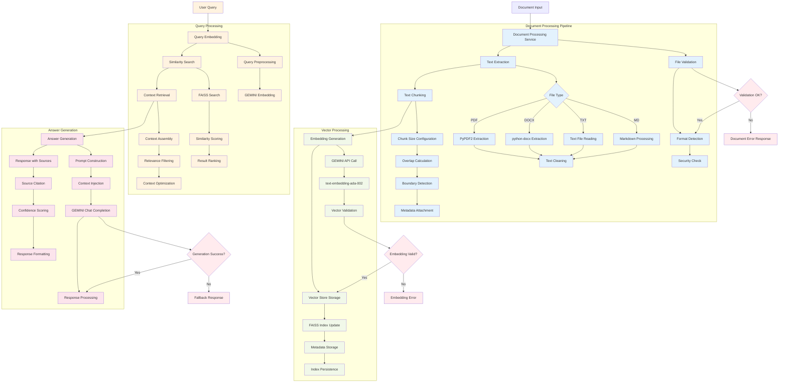

## Document Processing Sequence

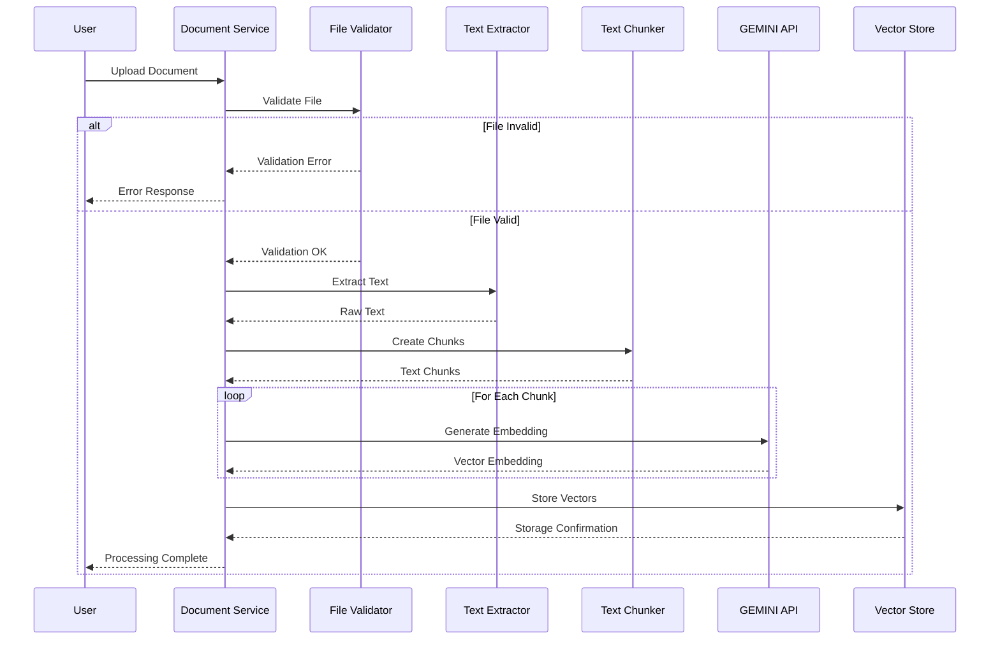

## RAG Query Processing Flow

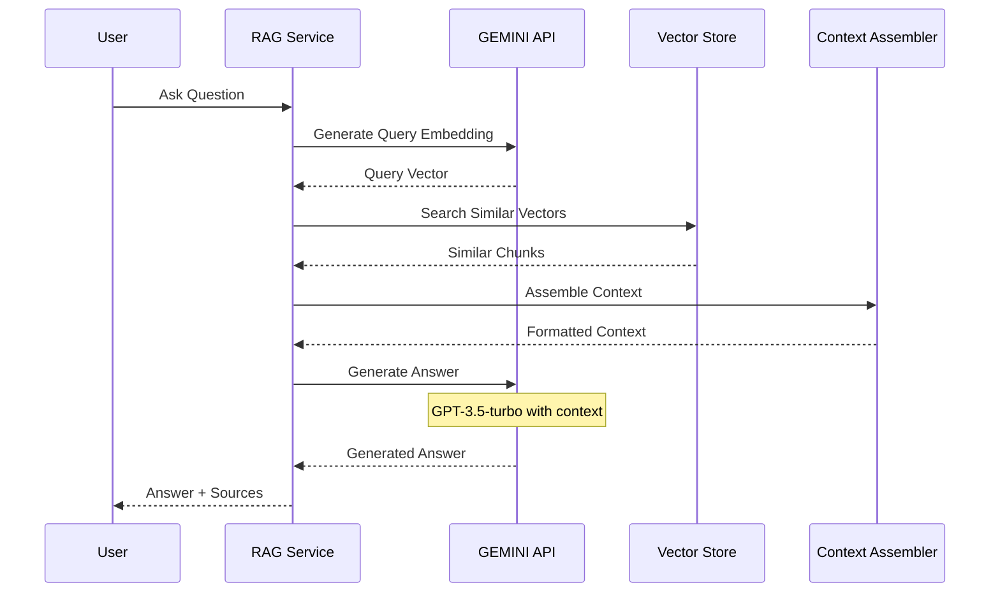

## Vector Store Architecture

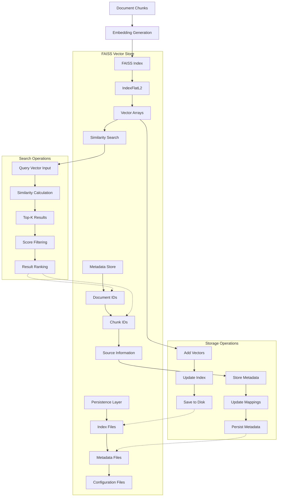

## GEMINI Integration Flow

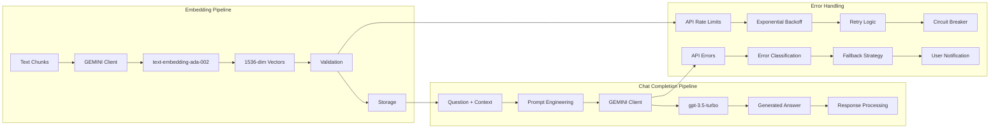

## Memory Management & Performance

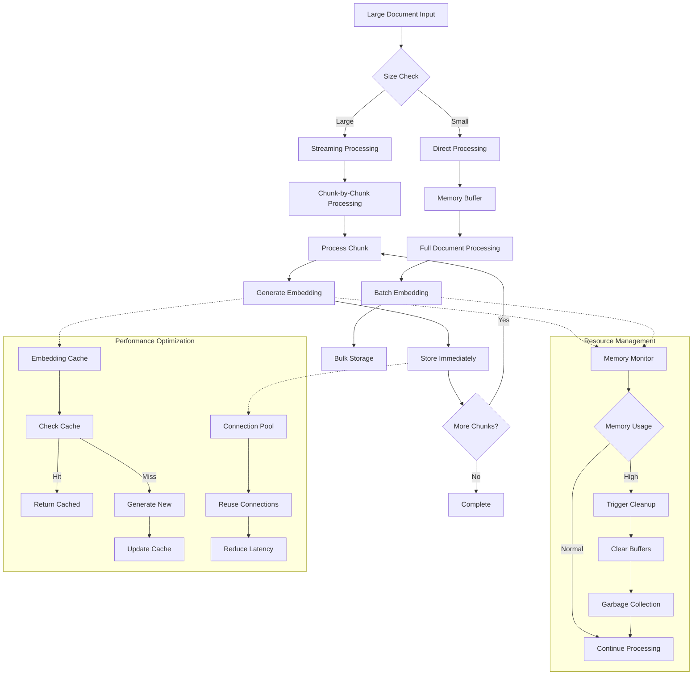

## Error Handling & Recovery

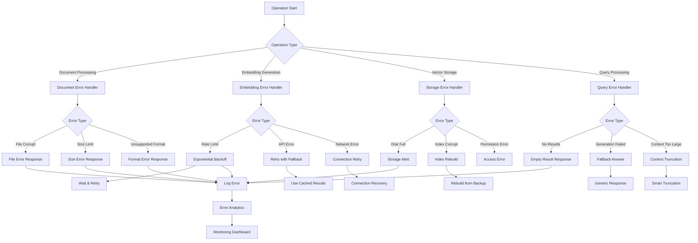

## Configuration & Settings Flow

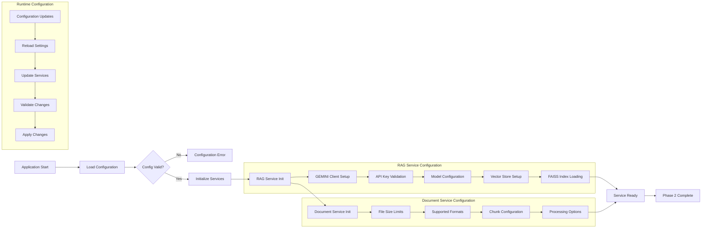

## Key Components Created

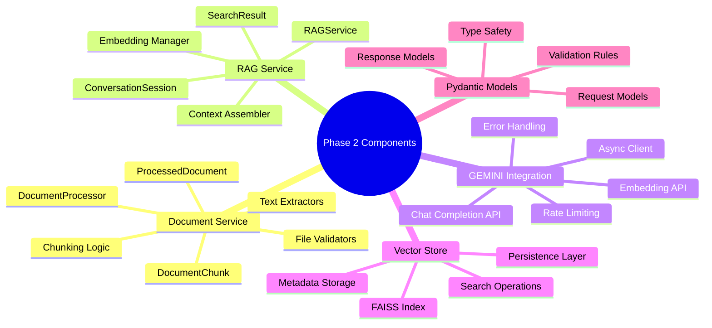

## Success Criteria Validation

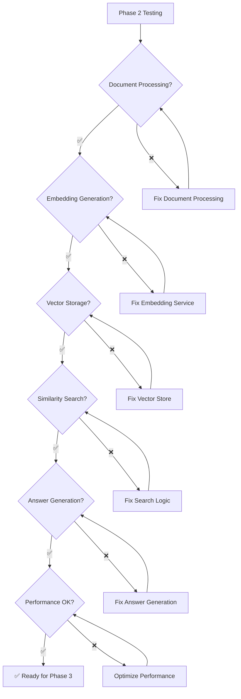

## Performance Metrics Dashboard

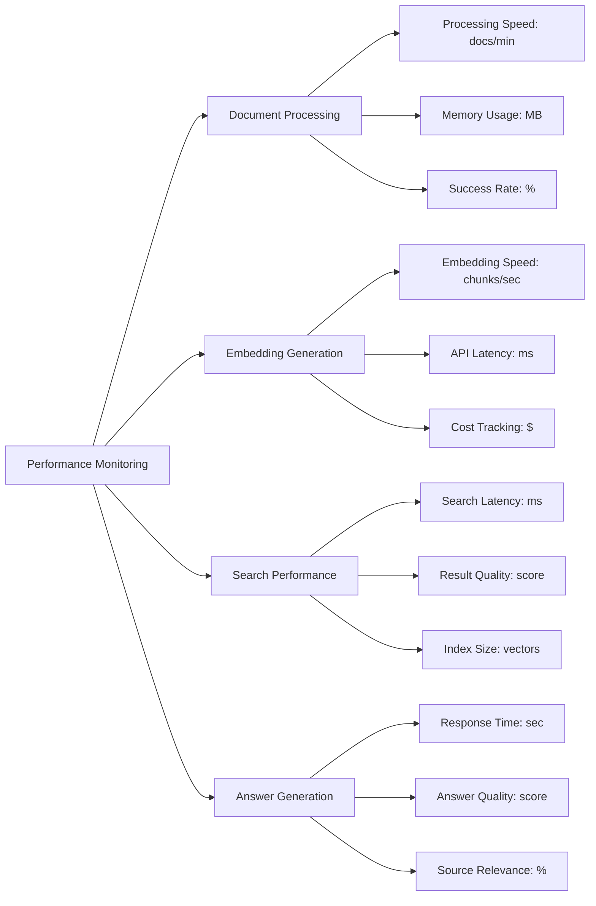

## Excalidraw Conversion Notes

For Excalidraw conversion:

1. **Process Boxes**: Use rounded rectangles for services/processes
2. **Decision Diamonds**: Use diamond shapes for conditional logic
3. **Data Stores**: Use cylinder shapes for databases/storage
4. **APIs**: Use cloud shapes for external services
5. **Flow Types**: 
   - Solid arrows for data flow
   - Dashed arrows for dependencies
   - Thick arrows for main workflow
6. **Color Coding**:
   - Blue: Document processing
   - Green: Vector operations  
   - Orange: Query processing
   - Pink: Answer generation
   - Red: Error handling
7. **Grouping**: Use background rectangles for logical groupings
8. **Icons**: Add small icons for different component types (document, database, API, etc.)