# Phase 3: API Endpoints Implementation - Workflow Diagram

## Complete API Architecture

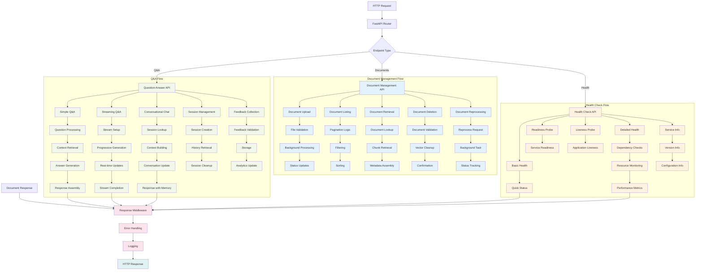

## Document Upload API Flow

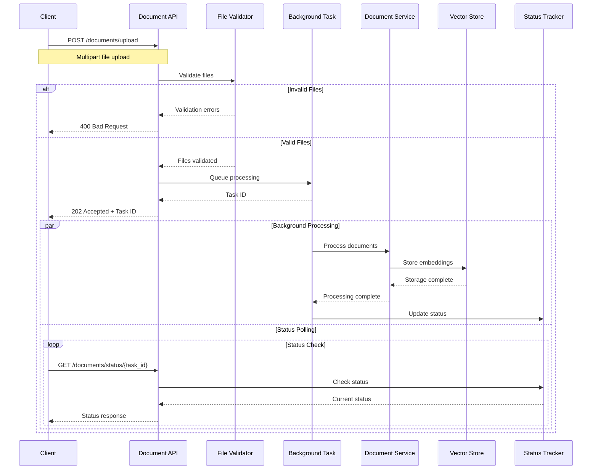

## Streaming Q&A Implementation

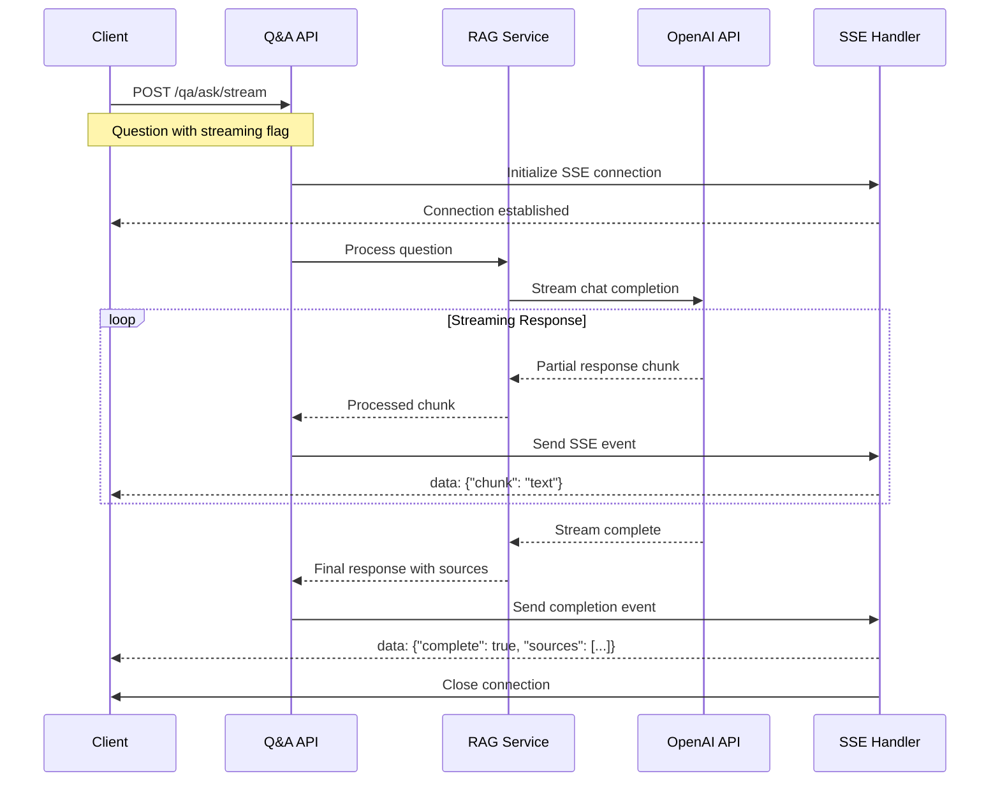

## Session Management Architecture

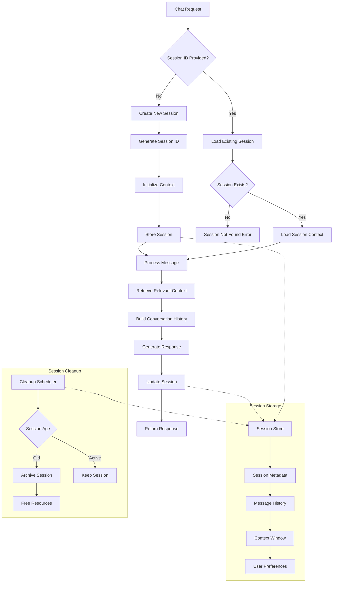

## Request Validation Pipeline

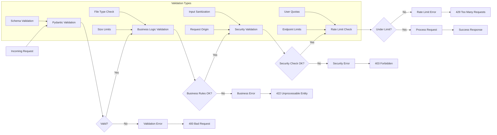

## Error Handling & Response Flow

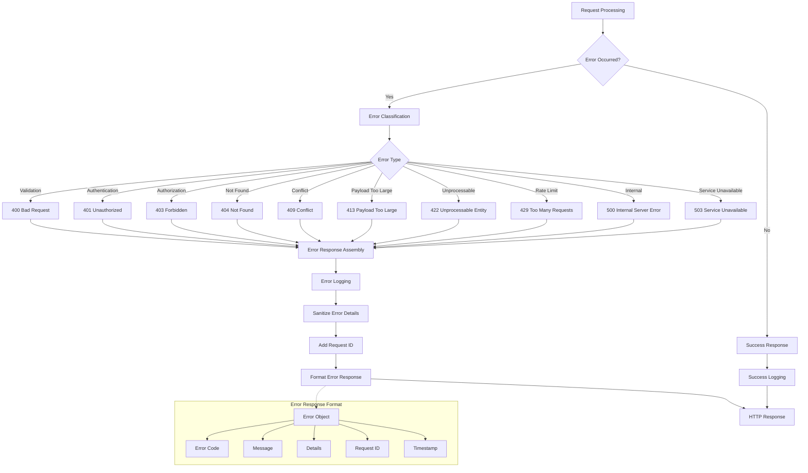

## API Dependency Injection

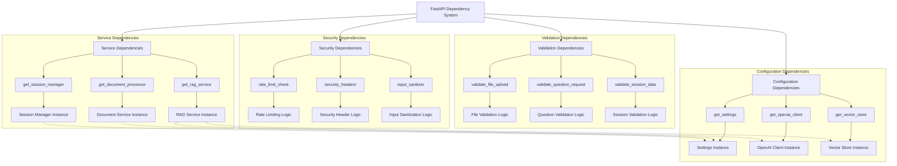

## Background Task Processing

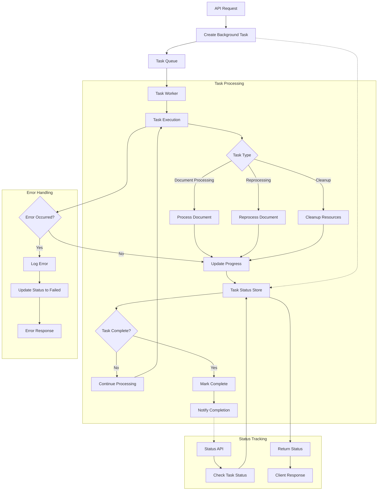

## API Performance Monitoring

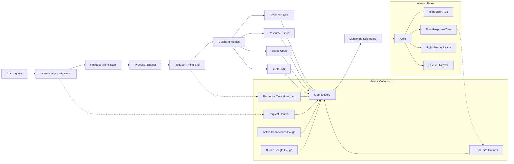

## OpenAPI Documentation Generation

```mermaid
graph TB
    A[FastAPI Application] --> B[Route Discovery]
    B --> C[Pydantic Model Analysis]
    C --> D[OpenAPI Schema Generation]
    
    subgraph "Schema Components"
        D --> E[Paths]
        E --> F[Request Models]
        F --> G[Response Models]
        G --> H[Error Models]
        H --> I[Security Schemas]
    end
    
    subgraph "Documentation Endpoints"
        I --> J[/docs - Swagger UI]
        I --> K[/redoc - ReDoc]
        I --> L[/openapi.json - Schema]
    end
    
    subgraph "Enhancement Features"
        M[Custom Descriptions] --> D
        N[Example Requests] --> F
        O[Example Responses] --> G
        P[Error Examples] --> H
        Q[Authentication Examples] --> I
    end
    
    subgraph "Interactive Features"
        J --> R[Try It Out]
        J --> S[Authentication Testing]
        J --> T[Response Validation]
        
        K --> U[Better Typography]
        K --> V[Code Examples]
        K --> W[Navigation]
    end
```

## Endpoint Testing Strategy

```mermaid
graph TB
    A[API Testing] --> B[Unit Tests]
    A --> C[Integration Tests]
    A --> D[Load Tests]
    A --> E[Security Tests]
    
    subgraph "Unit Tests"
        B --> B1[Endpoint Logic]
        B --> B2[Request Validation]
        B --> B3[Response Formatting]
        B --> B4[Error Handling]
    end
    
    subgraph "Integration Tests"
        C --> C1[End-to-End Workflows]
        C --> C2[Service Integration]
        C --> C3[Database Operations]
        C --> C4[External API Calls]
    end
    
    subgraph "Load Tests"
        D --> D1[Concurrent Requests]
        D --> D2[High Throughput]
        D --> D3[Memory Usage]
        D --> D4[Response Times]
    end
    
    subgraph "Security Tests"
        E --> E1[Input Validation]
        E --> E2[Authentication]
        E --> E3[Authorization]
        E --> E4[Rate Limiting]
    end
    
    subgraph "Test Tools"
        F[pytest] --> B
        G[httpx] --> C
        H[locust] --> D
        I[security scanners] --> E
    end
```

## Success Criteria Validation

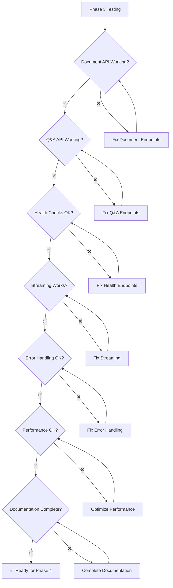

## Excalidraw Conversion Guidelines

For converting to Excalidraw:

1. **Shapes**:
   - Rectangles: API endpoints and processes
   - Rounded rectangles: Services and handlers
   - Diamonds: Decision points
   - Cylinders: Data stores
   - Clouds: External services

2. **Colors**:
   - Blue (#e3f2fd): Document management
   - Green (#f1f8e9): Q&A functionality  
   - Orange (#fff3e0): Health checks
   - Pink (#fce4ec): Middleware/processing
   - Teal (#e0f2f1): Responses

3. **Flow Types**:
   - Solid thick arrows: Main request flow
   - Solid thin arrows: Data flow
   - Dashed arrows: Dependencies
   - Dotted arrows: Async/background processes

4. **Grouping**:
   - Background rectangles for API groups
   - Swim lanes for different service layers
   - Containers for related components

5. **Labels**:
   - HTTP methods and status codes
   - Service names and versions
   - Performance metrics
   - Error types and codes