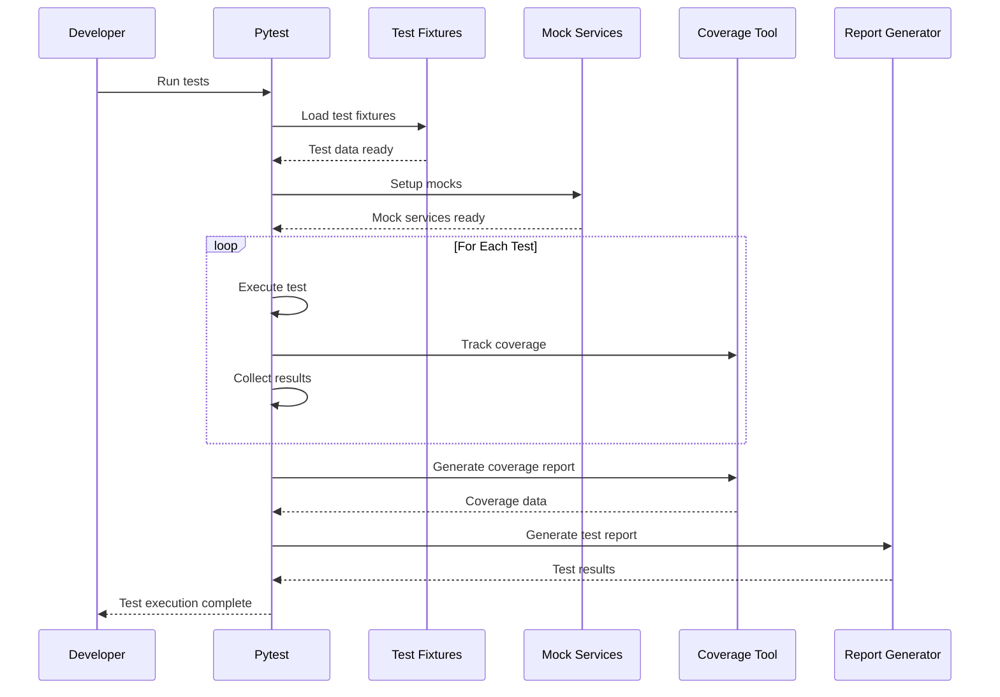
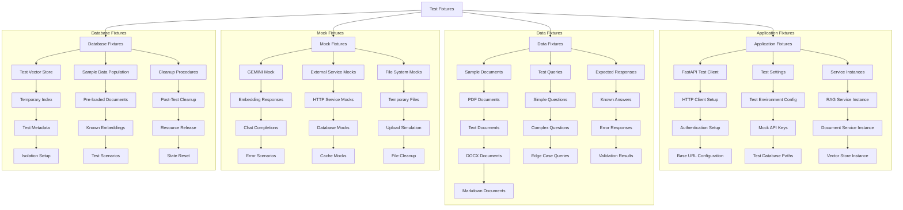
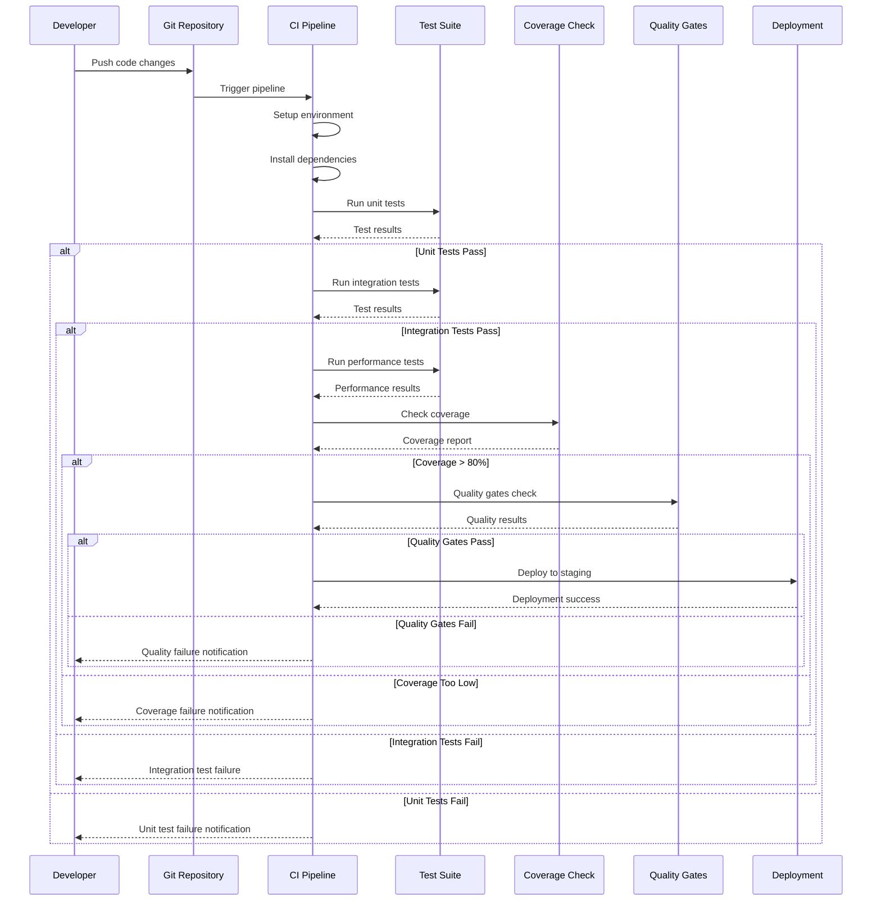
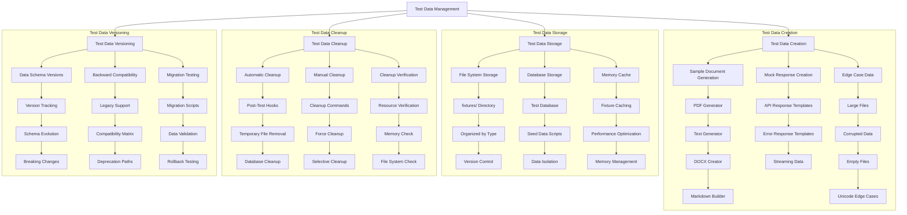
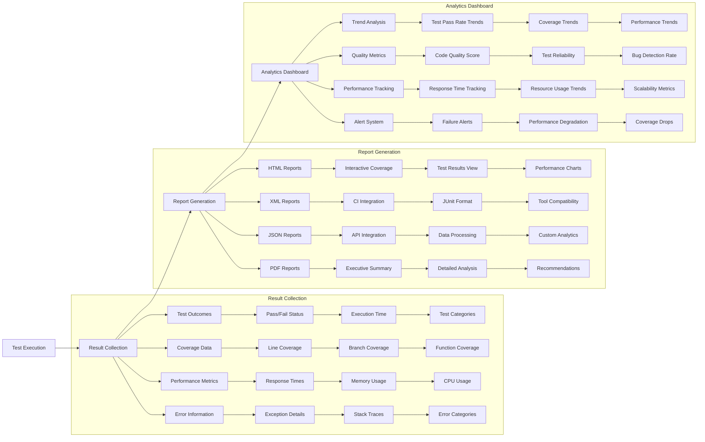
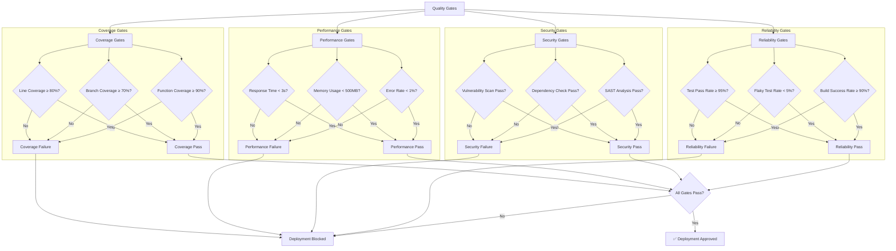

# Phase 4: Testing Framework - Workflow Diagram

## Complete Testing Architecture

```mermaid
graph TB
    A[Testing Framework] --> B[Test Categories]
    B --> C[Unit Tests]
    B --> D[Integration Tests]
    B --> E[Performance Tests]
    B --> F[API Tests]
    
    subgraph "Unit Testing Flow"
        C --> C1[Configuration Tests]
        C --> C2[Service Tests]
        C --> C3[Utility Tests]
        C --> C4[Model Tests]
        
        C1 --> C1A[Settings Validation]
        C1A --> C1B[Environment Loading]
        C1B --> C1C[Config Errors]
        
        C2 --> C2A[Document Service]
        C2A --> C2B[RAG Service]
        C2B --> C2C[Vector Operations]
        
        C3 --> C3A[Logger Functions]
        C3A --> C3B[Exception Handling]
        C3B --> C3C[Helper Functions]
        
        C4 --> C4A[Request Models]
        C4A --> C4B[Response Models]
        C4B --> C4C[Validation Rules]
    end
    
    subgraph "Integration Testing Flow"
        D --> D1[End-to-End Workflows]
        D --> D2[Service Integration]
        D --> D3[Database Operations]
        D --> D4[External API Integration]
        
        D1 --> D1A[Upload → Process → Query]
        D1A --> D1B[Multi-Document Scenarios]
        D1B --> D1C[Error Recovery]
        
        D2 --> D2A[Service Communication]
        D2A --> D2B[Dependency Injection]
        D2B --> D2C[Cross-Service Validation]
        
        D3 --> D3A[Vector Store Operations]
        D3A --> D3B[Metadata Management]
        D3B --> D3C[Persistence Testing]
        
        D4 --> D4A[GEMINI API Integration]
        D4A --> D4B[Rate Limiting]
        D4B --> D4C[Error Handling]
    end
    
    subgraph "Performance Testing Flow"
        E --> E1[Load Testing]
        E --> E2[Stress Testing]
        E --> E3[Benchmark Testing]
        E --> E4[Resource Monitoring]
        
        E1 --> E1A[Concurrent Users]
        E1A --> E1B[Request Throughput]
        E1B --> E1C[Response Times]
        
        E2 --> E2A[Resource Limits]
        E2A --> E2B[Breaking Points]
        E2B --> E2C[Recovery Testing]
        
        E3 --> E3A[Processing Speed]
        E3A --> E3B[Memory Usage]
        E3B --> E3C[Regression Detection]
        
        E4 --> E4A[CPU Monitoring]
        E4A --> E4B[Memory Tracking]
        E4B --> E4C[I/O Performance]
    end
    
    subgraph "API Testing Flow"
        F --> F1[Endpoint Testing]
        F --> F2[Authentication Testing]
        F --> F3[Error Response Testing]
        F --> F4[OpenAPI Compliance]
        
        F1 --> F1A[Request Validation]
        F1A --> F1B[Response Format]
        F1B --> F1C[Status Codes]
        
        F2 --> F2A[Authentication Methods]
        F2A --> F2B[Authorization Levels]
        F2B --> F2C[Security Headers]
        
        F3 --> F3A[Error Scenarios]
        F3A --> F3B[Error Messages]
        F3B --> F3C[Error Codes]
        
        F4 --> F4A[Schema Validation]
        F4A --> F4B[Documentation Sync]
        F4B --> F4C[Example Validation]
    end

    %% Test Execution Flow
    G[Test Execution] --> H[Test Discovery]
    H --> I[Test Selection]
    I --> J[Test Running]
    J --> K[Result Collection]
    K --> L[Report Generation]
    
    %% Quality Gates
    L --> M{Coverage > 80%?}
    M -->|No| N[Coverage Failure]
    M -->|Yes| O{Performance OK?}
    O -->|No| P[Performance Failure]
    O -->|Yes| Q{All Tests Pass?}
    Q -->|No| R[Test Failures]
    Q -->|Yes| S[✅ Tests Passed]

    %% Styling
    classDef unitTest fill:#e3f2fd
    classDef integrationTest fill:#f1f8e9
    classDef performanceTest fill:#fff3e0
    classDef apiTest fill:#fce4ec
    classDef execution fill:#e0f2f1
    classDef quality fill:#ffebee

    class C,C1,C2,C3,C4,C1A,C1B,C1C,C2A,C2B,C2C,C3A,C3B,C3C,C4A,C4B,C4C unitTest
    class D,D1,D2,D3,D4,D1A,D1B,D1C,D2A,D2B,D2C,D3A,D3B,D3C,D4A,D4B,D4C integrationTest
    class E,E1,E2,E3,E4,E1A,E1B,E1C,E2A,E2B,E2C,E3A,E3B,E3C,E4A,E4B,E4C performanceTest
    class F,F1,F2,F3,F4,F1A,F1B,F1C,F2A,F2B,F2C,F3A,F3B,F3C,F4A,F4B,F4C apiTest
    class G,H,I,J,K,L execution
    class M,N,O,P,Q,R,S quality
```

## Test Execution Pipeline

## Test Fixture Architecture

## Mock Strategy Implementation

```mermaid
graph TB
    A[Mock Strategy] --> B[GEMINI API Mocking]
    A --> C[File System Mocking]
    A --> D[Database Mocking]
    A --> E[Network Mocking]
    
    subgraph "GEMINI API Mocking"
        B --> B1[Embedding API Mock]
        B --> B2[Chat Completion Mock]
        B --> B3[Error Simulation]
        
        B1 --> B1A[Deterministic Embeddings]
        B1A --> B1B[Consistent Vectors]
        B1B --> B1C[Performance Simulation]
        
        B2 --> B2A[Pre-defined Answers]
        B2A --> B2B[Streaming Simulation]
        B2B --> B2C[Token Usage Tracking]
        
        B3 --> B3A[Rate Limit Errors]
        B3A --> B3B[API Failures]
        B3B --> B3C[Network Timeouts]
    end
    
    subgraph "File System Mocking"
        C --> C1[File Upload Simulation]
        C --> C2[Storage Operations]
        C --> C3[File Access Control]
        
        C1 --> C1A[Multipart Upload Mock]
        C1A --> C1B[File Validation Mock]
        C1B --> C1C[Size Limit Testing]
        
        C2 --> C2A[Read Operations]
        C2A --> C2B[Write Operations]  
        C2B --> C2C[Delete Operations]
        
        C3 --> C3A[Permission Testing]
        C3A --> C3B[Access Errors]
        C3B --> C3C[Security Validation]
    end
    
    subgraph "Database Mocking"
        D --> D1[Vector Store Mock]
        D --> D2[Metadata Store Mock]
        D --> D3[Transaction Mock]
        
        D1 --> D1A[Search Operations]
        D1A --> D1B[Index Operations]
        D1B --> D1C[Performance Simulation]
        
        D2 --> D2A[CRUD Operations]
        D2A --> D2B[Query Simulation]
        D2B --> D2C[Consistency Testing]
        
        D3 --> D3A[Commit/Rollback]
        D3A --> D3B[Isolation Testing]
        D3B --> D3C[Concurrency Control]
    end
    
    subgraph "Network Mocking"
        E --> E1[HTTP Request Mock]
        E --> E2[Response Simulation]
        E --> E3[Network Errors]
        
        E1 --> E1A[Request Validation]
        E1A --> E1B[Header Checking]
        E1B --> E1C[Body Verification]
        
        E2 --> E2A[Status Code Control]
        E2A --> E2B[Response Body Mock]
        E2B --> E2C[Timing Simulation]
        
        E3 --> E3A[Connection Errors]
        E3A --> E3B[Timeout Errors]
        E3B --> E3C[DNS Errors]
    end
```

## Performance Testing Architecture

```mermaid
graph TB
    A[Performance Testing] --> B[Load Testing]
    A --> C[Stress Testing]
    A --> D[Volume Testing]
    A --> E[Endurance Testing]
    
    subgraph "Load Testing Setup"
        B --> B1[User Simulation]
        B --> B2[Request Patterns]
        B --> B3[Ramp-up Strategy]
        
        B1 --> B1A[Concurrent Users: 1-50]
        B1A --> B1B[User Behavior Modeling]
        B1B --> B1C[Session Management]
        
        B2 --> B2A[Document Upload Load]
        B2A --> B2B[Q&A Query Load]
        B2B --> B2C[Mixed Workload]
        
        B3 --> B3A[Gradual Increase]
        B3A --> B3B[Spike Testing]
        B3B --> B3C[Sustained Load]
    end
    
    subgraph "Stress Testing Setup"
        C --> C1[Resource Limits]
        C --> C2[Breaking Points]
        C --> C3[Recovery Testing]
        
        C1 --> C1A[Memory Exhaustion]
        C1A --> C1B[CPU Saturation]
        C1B --> C1C[Disk Space Limits]
        
        C2 --> C2A[Maximum Throughput]
        C2A --> C2B[Error Thresholds]
        C2B --> C2C[System Limits]
        
        C3 --> C3A[Graceful Degradation]
        C3A --> C3B[Service Recovery]
        C3B --> C3C[Data Consistency]
    end
    
    subgraph "Volume Testing Setup"
        D --> D1[Large Document Sets]
        D --> D2[High Query Volume]
        D --> D3[Data Scaling]
        
        D1 --> D1A[1000+ Documents]
        D1A --> D1B[Large File Sizes]
        D1B --> D1C[Processing Time]
        
        D2 --> D2A[10000+ Queries]
        D2A --> D2B[Complex Questions]
        D2B --> D2C[Response Quality]
        
        D3 --> D3A[Vector Store Scaling]
        D3A --> D3B[Memory Usage]
        D3B --> D3C[Search Performance]
    end
    
    subgraph "Endurance Testing Setup"
        E --> E1[Long Duration]
        E --> E2[Memory Leaks]
        E --> E3[Resource Cleanup]
        
        E1 --> E1A[24+ Hour Runs]
        E1A --> E1B[Sustained Load]
        E1B --> E1C[Performance Drift]
        
        E2 --> E2A[Memory Monitoring]
        E2A --> E2B[Leak Detection]
        E2B --> E2C[Resource Growth]
        
        E3 --> E3A[File Cleanup]
        E3A --> E3B[Connection Cleanup]
        E3B --> E3C[Cache Management]
    end
```

## Continuous Integration Test Flow

## Test Data Management

## Test Reporting & Analytics

## Quality Gates Implementation

## Excalidraw Conversion Guidelines

For Excalidraw conversion:

1. **Shapes & Icons**:
   - Rectangle: Test categories and processes
   - Circle: Start/end points
   - Diamond: Decision points and quality gates
   - Hexagon: Mock services and external dependencies
   - Cloud: CI/CD pipeline components

2. **Color Scheme**:
   - Blue (#e3f2fd): Unit tests
   - Green (#f1f8e9): Integration tests
   - Orange (#fff3e0): Performance tests
   - Pink (#fce4ec): API tests
   - Teal (#e0f2f1): Test execution flow
   - Red (#ffebee): Quality gates and failures

3. **Flow Indicators**:
   - Solid arrows: Sequential test flow
   - Dashed arrows: Dependencies and relationships
   - Thick arrows: Main execution path
   - Dotted arrows: Async operations and callbacks

4. **Grouping Elements**:
   - Background rectangles: Test categories
   - Swim lanes: Different test phases
   - Containers: Related test components
   - Frames: Quality assurance processes

5. **Status Indicators**:
   - Green check marks: Passed tests/gates
   - Red X marks: Failed tests/gates
   - Yellow warning signs: Performance issues
   - Progress bars: Coverage and metrics